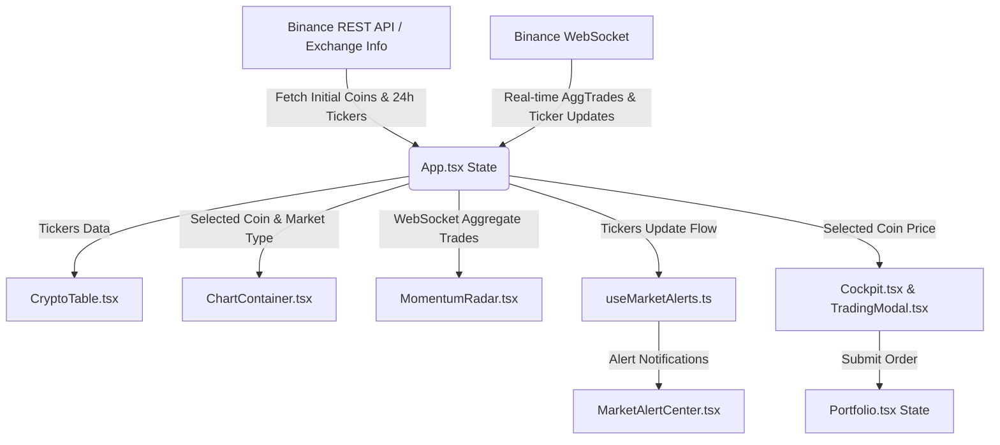

# Antigravity Crypto - 系統架構說明書 (Architecture)

## 1. 專案概述 (Project Overview)
本專案名為 **Antigravity Crypto (收割機駕駛艙)**，是一個基於 React、TypeScript、Vite 與 Electron 構建的桌面級加密貨幣行情看盤、動能預警與模擬交易系統。
系統透過 Binance API 和 WebSocket 提供即時的現貨（Spot）與永續合約（Futures）行情，並內建技術指標信號建議、動能突破雷達、自訂預警以及模擬交易帳戶管理。

---

## 2. 技術棧 (Technology Stack)
- **前端框架**：React 19, TypeScript
- **建置工具**：Vite 8
- **桌面殼套**：Electron 42
- **圖表庫**：Lightweight Charts (TradingView) 5.2.0
- **圖標庫**：Lucide-React
- **資料來源**：Binance REST API (v3 / fapi v1) 與 WebSocket 行情伺服器
- **打包工具**：Electron Builder (打包為 Windows Portable 可執行檔)

---

## 3. 目錄結構分析 (Directory Structure)

```text
d:/PYTHON/fadachi/
├── package.json               # 專案依賴與 Electron 打包配置 (定義 electron-builder 打包輸出)
├── main.cjs                   # Electron 主進程 (載入前端並處理視窗，無 IPC 通訊邏輯)
├── vite.config.ts             # Vite 建置配置
├── index.html                 # 應用入口 HTML 範本
├── src/
│   ├── main.tsx               # 前端進入點 (掛載 App)
│   ├── App.tsx                # 主要版面控制器 (切換 Tabs, WebSocket 連線管理)
│   ├── App.css                # 全域基本樣式
│   ├── index.css              # 主設計系統與 Tailwind/CSS 樣式規則
│   ├── components/            # UI 元件目錄
│   │   ├── ChartContainer.tsx # K線圖表繪製元件 (支援 MA, EMA, MACD, Volume)
│   │   ├── Cockpit.tsx        # 模擬交易駕駛艙主元件 (持倉、下單、槓桿、盈虧)
│   │   ├── CryptoTable.tsx    # 行情列表 (支援現貨/合約切換、自選、即時更新)
│   │   ├── MarketAlertCenter.tsx # 預警管理中心 (新增、刪除、觸發歷史)
│   │   ├── MomentumRadar.tsx  # 動能雷達 (動能突變、突破監測)
│   │   ├── Portfolio.tsx      # 模擬資產組合 (持倉比例、PnL 圖表、歷史明細)
│   │   ├── SignalAdvisor.tsx  # 多空信號分析面板
│   │   └── TradingModal.tsx   # 下單交易彈出窗
│   ├── hooks/
│   │   └── useMarketAlerts.ts # 警報核心邏輯 Hook (通知與觸發判斷)
│   └── services/
│       ├── binance.ts         # Binance API 串接服務 (REST & WebSocket)
│       ├── marketAlerts.ts    # 警報類型定義與偵測演算法
│       └── utils.ts           # 金額、比率格式化等工具函數
```

---

## 4. 模組互動與資料流 (Data Flow)

### 4.1 系統架構資料流



### 4.2 Electron 與前端關係
- **單向加殼模式**：Electron 主進程 (`main.cjs`) 僅負責視窗初始化並載入前端建置後的靜態資源 (`dist/index.html`)。
- **無跨進程通訊**：前端與主進程之間目前無 `ipcMain` 與 `ipcRenderer` 通訊，所有網路連線（API 與 WebSocket）與資料儲存（LocalStorage）皆在 Render 進程內完成。

---

## 5. 核心機制與狀態管理 (Core Mechanism & State Management)

1. **即時數據同步與 WebSocket 分流策略**：
   - **永續合約模式**：由於 Binance 合約支持全市場行情廣播，因此訂閱 `wss://fstream.binance.com/market/ws/!ticker@arr` 以低頻寬獲取全市場行情。
   - **現貨模式**：由於現貨全市場廣播被限制，採用動態**組合流 (Combined Streams)** 機制，只訂閱當前選中及自選清單的對應頻道（如 `stream?streams=btcusdt@ticker/...`）。
   - **動能成交監測**：針對前 60 個高流動性交易對，訂閱個股 `aggTrade` 串流，並進行大單過濾與動能累加計算。
   - **重連與容錯**：具備**指數退避（Exponential Backoff）重連演算法**（最大重連延遲 30 秒），且設有 Fetch 超時控制器（3000ms），防止網路請求掛起。
2. **模擬交易系統與狀態流轉**：
   - 本地儲存：交易帳戶餘額、持倉記錄、交易歷史與自選清單皆持久化於瀏覽器的 `localStorage` 中。
   - 狀態傳遞：使用 React Props 傳遞與 React State 上抬（State Lifting）方式，在 `App.tsx` 維護全域的持倉狀態，並同步給 `Cockpit` 與 `Portfolio` 元件。
   - 支援功能：支援「市價」與「限價」單，並在合約模式下支援多/空雙向開倉、自訂槓桿與保證金計算。
3. **動能雷達 & 信號顧問**：
   - 雷達依據 WebSocket 即時逐筆成交（Aggregate Trade）數據，計算短時間內的資金流入/流出速度與大單成交，提醒動能突破。
   - 信號顧問結合 K 線數據（MA、EMA、MACD），判定技術指標趨勢，為模擬交易提供參考。

---

## 6. 開發與部署指南 (Development & Deployment)
### 6.1 本地開發
- **執行前端**：在瀏覽器中開發：
  ```bash
  npm run dev
  ```
- **執行桌面端**：啟動 Electron 整合視窗：
  ```bash
  npm run desktop:start
  ```

### 6.2 專案打包
- **Windows 可執行檔**：執行以下指令，透過 `electron-builder` 編譯免安裝可執行檔：
  ```bash
  npm run desktop:build
  ```
  打包完成後，輸出檔案會生成於 `dist-desktop/` 目錄中。
